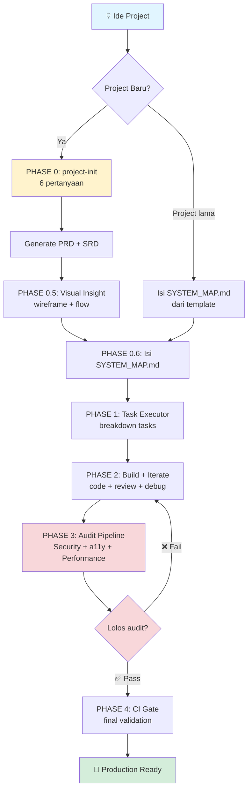
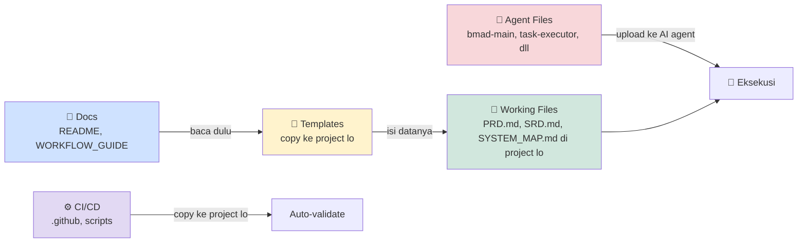
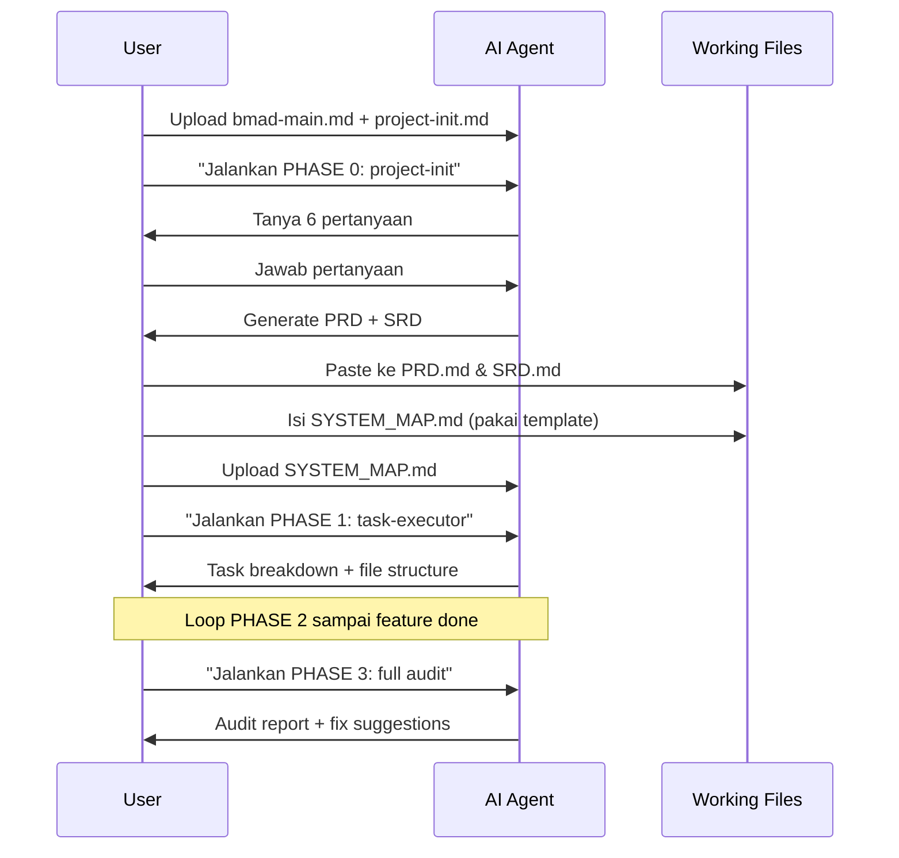
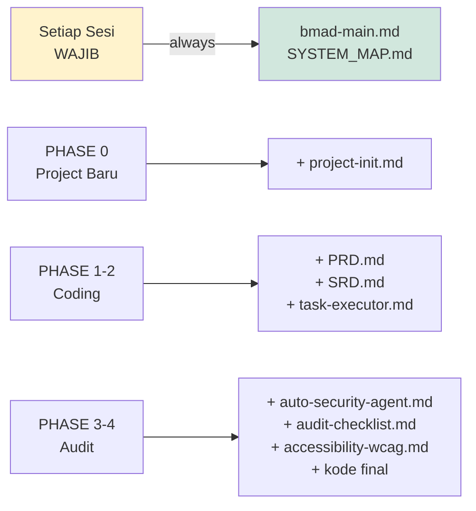
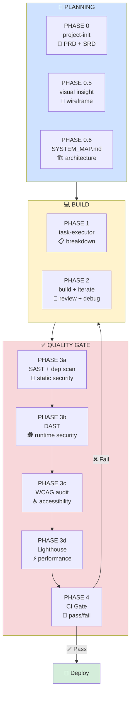
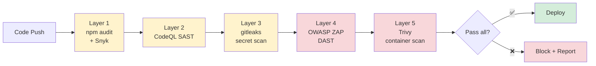

# 🚀 BMAD Workflow V1.0

**AI-driven engineering workflow** untuk bangun aplikasi yang **aman, aksesibel, performant** — dari ide sampai deploy.

> **Untuk siapa:** developer yang mau pakai AI agent (Claude Code, Cursor, Codex, Gemini, opencode, Kiro, dll) untuk bangun project secara terstruktur, dengan quality gate otomatis.

---

## 📑 Daftar Isi

- [Apa Itu BMAD Workflow?](#-apa-itu-bmad-workflow)
- [Big Picture (Visual)](#-big-picture-visual)
- [Project Structure](#-project-structure)
- [Mental Model: 4 Tipe File](#-mental-model-4-tipe-file)
- [Getting Started](#-getting-started)
- [Pipeline Flow Lengkap](#-pipeline-flow-lengkap)
- [Quality Standards](#-quality-standards)
- [FAQ](#-faq)

---

## 🎯 Apa Itu BMAD Workflow?

**BMAD** = **B**rainstorm → **M**odel → **A**rchitect → **D**evelop

4 tahap berpikir yang dieksekusi lewat **7 phase teknis (PHASE 0–4)** dengan AI sebagai eksekutor.

### Yang Lo Dapat:

| Aspek | Output | Tools |
|---|---|---|
| 🧠 **Planning** | PRD + SRD + SYSTEM_MAP yang siap pakai | `project-init.md` |
| 💻 **Coding** | Task breakdown + implementasi terstruktur | `task-executor.md` |
| 🔐 **Security** | SAST + DAST + secret scan + dep scan | OWASP ZAP, CodeQL, Snyk, gitleaks, Trivy |
| ♿ **Accessibility** | WCAG 2.1 AA enforcement | axe-core |
| ⚡ **Performance** | Lighthouse score ≥ 90 enforced | Lighthouse CI |
| 🤖 **Automation** | CI gate auto pass/fail | GitHub Actions |
| 🧠 **Code Intelligence** | Pre-built knowledge graph (callers, callees, impact) | codegraph (MCP) |
| 📦 **Context Compression** | ~85% token savings combined | lean-ctx (MCP) |

---

## 🗺️ Big Picture (Visual)

### High-Level: Dari Ide ke Production



### Alternatif (ASCII — kalau Mermaid nggak render):

```
   💡 IDE PROJECT
        │
        ▼
   ┌─────────────┐
   │ PHASE 0     │  → project-init (6 pertanyaan)
   │             │  → output: PRD.md + SRD.md
   └──────┬──────┘
          │
          ▼
   ┌─────────────┐
   │ PHASE 0.5   │  → Visual Insight (wireframe + flow)
   └──────┬──────┘
          │
          ▼
   ┌─────────────┐
   │ PHASE 0.6   │  → Isi SYSTEM_MAP.md (architecture)
   └──────┬──────┘
          │
          ▼
   ┌─────────────┐
   │ PHASE 1     │  → Task breakdown
   └──────┬──────┘
          │
          ▼
   ┌─────────────┐
   │ PHASE 2     │  ← review + debug loop
   │ Build +     │
   │ Iterate     │
   └──────┬──────┘
          │
          ▼
   ┌─────────────┐
   │ PHASE 3     │  → Security + a11y + Performance
   │ Audit       │
   └──────┬──────┘
          │
       ┌──┴──┐
       │ ❌  │ ←── balik ke PHASE 2
       │ ✅  │
       └──┬──┘
          │
          ▼
   ┌─────────────┐
   │ PHASE 4     │  → CI Gate (auto pass/fail)
   └──────┬──────┘
          │
          ▼
   🚀 PRODUCTION READY
```

---

## 📁 Project Structure

```
BMAD-Workflow-V1.0/
│
├── 📘 README.md                    ← lo lagi baca ini (dokumentasi utama)
├── 📘 WORKFLOW_GUIDE.md            ← guide visual lengkap (utk PDF print)
│
├── 🎯 bmad-main.md                 ← ⭐ ENTRY POINT (upload setiap sesi)
│                                     ↳ BMAD philosophy + 7 phases + agent rules
│
├── 📂 templates/                   ← Template siap-copy ke project lo
│   ├── PRD.template.md             ← Product requirements
│   ├── SRD.template.md             ← System/tech requirements
│   ├── SYSTEM_MAP.template.md      ← Architecture map ⚠️ WAJIB
│   └── mcp.template.json           ← MCP server config
│
├── 📂 .github/                     ← CI/CD ready-to-use
│   ├── dependabot.yml              ← Auto dependency updates
│   └── workflows/
│       ├── audit-pipeline.yml      ← PHASE 3-4: SAST+DAST+Lighthouse+a11y
│       └── security-scan.yml       ← Layered: CodeQL+Snyk+gitleaks+Trivy
│
├── 📂 scripts/
│   └── ci-gate.js                  ← Aggregator: validate audit → pass/fail
│
├── 🤖 Agent Files (per-phase):
│   ├── project-init.md             ← PHASE 0
│   ├── task-executor.md            ← PHASE 1
│   ├── auto-code-review.md         ← PHASE 2
│   ├── bug-hunter.md               ← PHASE 2
│   └── auto-security-agent.md      ← PHASE 3-4
│
└── 📚 Reference Docs:
    ├── audit-checklist.md          ← Manual audit checklist
    └── accessibility-wcag.md       ← WCAG 2.1 guidelines
```

---

## 🧭 Mental Model: 4 Tipe File

Sebelum mulai, paham dulu tipe file di sini supaya nggak bingung:



| Tipe | Lokasi | Fungsi | Contoh |
|---|---|---|---|
| 📘 **Docs** | Root repo | Baca untuk paham workflow | `README.md`, `WORKFLOW_GUIDE.md` |
| 📂 **Templates** | `/templates/` | Cetakan untuk working file | `PRD.template.md` |
| 📝 **Working Files** | Di project lo | Hasil isi template, di-edit per project | `PRD.md`, `SRD.md`, `SYSTEM_MAP.md` |
| 🤖 **Agent Files** | Root repo | Upload ke AI agent per phase | `bmad-main.md`, `task-executor.md` |
| ⚙️ **CI/CD Files** | `.github/`, `scripts/` | Copy ke project lo, auto-run di GitHub | `audit-pipeline.yml` |

> **Aturan emas:** Repo BMAD-Workflow ini = **toolkit**. Project lo = **tempat kerja**. Toolkit dipisah dari kerjaan supaya update toolkit nggak bentrok dengan progress project lo.

---

## 🚀 Getting Started

### Step 0 — Setup Awal (Sekali Aja)

```bash
# Di project lo (BUKAN di repo workflow ini):

# 1. Copy template doc ke root project lo
cp templates/PRD.template.md         /path/ke/project-lo/PRD.md
cp templates/SRD.template.md         /path/ke/project-lo/SRD.md
cp templates/SYSTEM_MAP.template.md  /path/ke/project-lo/SYSTEM_MAP.md

# 2. Copy MCP config (untuk Claude Code / Cursor / Codex / Gemini / opencode / dll)
cp templates/mcp.template.json       /path/ke/project-lo/mcp.json

# 3. Copy CI/CD setup (audit pipeline + security scan)
cp -r .github                        /path/ke/project-lo/
cp -r scripts                        /path/ke/project-lo/

# 4. Install codegraph (sekali per machine — recommended)
# macOS/Linux:
curl -fsSL https://raw.githubusercontent.com/colbymchenry/codegraph/main/install.sh | sh
# Windows (PowerShell):
irm https://raw.githubusercontent.com/colbymchenry/codegraph/main/install.ps1 | iex
# Atau via npm:
npx @colbymchenry/codegraph

# 5. Build code intelligence index di project lo
cd /path/ke/project-lo && codegraph init -i
```

> 💡 **Why codegraph?** Pre-built knowledge graph yang bantu AI navigate codebase tanpa grep/read loop. Hemat ~35% cost + ~70% tool calls. Local-only (SQLite). Kombinasi dengan lean-ctx = ~85% token savings compounding.

### Project Baru? Mulai dari Sini



### Project yang Sudah Jalan?

```
1. Isi SYSTEM_MAP.md dulu pakai template (paling penting)
2. Upload bmad-main.md + SYSTEM_MAP.md + kode lo ke AI agent (Claude Code / Cursor / Codex / dll)
3. Ketik: "Jalankan PHASE 3: full audit"
```

### Upload Apa, Kapan?



| Skenario | Upload ke AI Agent |
|---|---|
| **Setiap sesi** (wajib) | `bmad-main.md` · `SYSTEM_MAP.md` |
| **Project baru** (PHASE 0) | + `project-init.md` |
| **Coding** (PHASE 1–2) | + `PRD.md` · `SRD.md` · `task-executor.md` |
| **Audit** (PHASE 3–4) | + `auto-security-agent.md` · `audit-checklist.md` · `accessibility-wcag.md` · kode final |

---

## 🔁 Pipeline Flow Lengkap



### Detail Per Phase

| Phase | Tujuan | File yang Dipakai | Output |
|---|---|---|---|
| **0** | Setup project | `project-init.md` | PRD.md + SRD.md |
| **0.5** | Visual alignment | (chat dengan Claude) | wireframe + user flow |
| **0.6** | Map architecture | `SYSTEM_MAP.template.md` | SYSTEM_MAP.md terisi |
| **1** | Task breakdown | `task-executor.md` | task list + file structure |
| **2** | Build features | `auto-code-review.md`, `bug-hunter.md` | working code |
| **3** | Quality audit | `auto-security-agent.md`, `accessibility-wcag.md` | audit reports |
| **4** | CI validation | `scripts/ci-gate.js` | PASS / FAIL verdict |

---

## 🛡️ Quality Standards

### 🔐 Security (Multi-Layer)



| Layer | Tool | Coverage |
|---|---|---|
| Dependency | `npm audit` + Snyk | Known CVEs + license |
| Auto-update | Dependabot | Weekly bump PR |
| Secrets | gitleaks | Code + git history |
| SAST | CodeQL | Code patterns + taint analysis |
| DAST | OWASP ZAP | Runtime vulns |
| Container | Trivy | OS + lib vulns |

### ♿ Accessibility — WCAG 2.1 AA Minimum

| Principle (POUR) | Required |
|---|---|
| **Perceivable** | Alt text, contrast ≥ 4.5:1, captions |
| **Operable** | Keyboard nav, focus visible, no traps |
| **Understandable** | Labels, clear errors, lang attr |
| **Robust** | Semantic HTML, valid markup, ARIA |

### ⚡ Performance — Lighthouse ≥ 90

```
┌─────────────────────────────┐
│  📊 Lighthouse Targets      │
├─────────────────────────────┤
│  Performance      ≥ 90      │
│  Accessibility    ≥ 90      │
│  Best Practices   ≥ 90      │
│  SEO              ≥ 90      │
└─────────────────────────────┘

  ❌ Satu di bawah 90 = BUILD FAIL
```

### 📊 Output Report Format

```json
{
  "security": {
    "critical": 0,
    "high": 0,
    "dast": { "tool": "OWASP ZAP", "high_alerts": 0, "status": "PASS" }
  },
  "accessibility": { "wcag_level": "AA", "violations": 0, "status": "PASS" },
  "lighthouse": {
    "performance": 92,
    "accessibility": 95,
    "best_practices": 90,
    "seo": 91
  },
  "status": "PASS"
}
```

---

## ❓ FAQ

### Q: Workflow ini cocok untuk stack apa?
A: Web app modern (React/Next.js/Vue/Svelte + Node.js/Express/NestJS). Bisa adapt ke stack lain dengan adjust di `auto-security-agent.md`.

### Q: Harus pakai Claude? Bisa pakai AI lain?
A: **Bebas pilih.** Workflow ini agent-agnostic. Support 8 AI agent via MCP: Claude Code, Cursor, Codex CLI, opencode, Hermes Agent, Gemini CLI, Antigravity IDE, Kiro. Bisa juga di Claude.ai web (drag & drop), atau AI lain (copy-paste prompt). codegraph MCP juga support semua agent ini — auto-detect via `codegraph install`.

### Q: Saya nggak punya tim DevOps, apakah CI ini terlalu rumit?
A: Nggak. Tinggal copy `.github/` ke repo lo, semuanya auto-run. Optional yang butuh setup tambahan: Snyk (free tier, cuma butuh `SNYK_TOKEN`).

### Q: WCAG AA itu wajib?
A: Untuk produk publik atau B2C: **wajib** (compliance + UX). Untuk internal tool: bisa relax ke A. Tapi audit-nya tetep jalan biar lo tau gap-nya.

### Q: Berapa lama setup awal?
A: 30 menit kalau lo udah punya GitHub repo. Brainstorm awal (PHASE 0) ~ 30-60 menit tergantung kompleksitas project.

### Q: Bisa pakai untuk project yang sudah jalan?
A: Bisa. Skip PHASE 0, langsung isi `SYSTEM_MAP.md` dari kondisi sekarang, lalu jalanin PHASE 3 (audit) untuk dapetin gap analysis.

### Q: PDF dokumentasi ada di mana?
A: Convert `WORKFLOW_GUIDE.md` ke PDF pakai:
- VSCode + Markdown PDF extension
- Pandoc: `pandoc WORKFLOW_GUIDE.md -o guide.pdf`
- Typora: File → Export → PDF

---

## 🧠 Philosophy

```
┌──────────────────────────────────────────┐
│  Satu pipeline, bukan banyak tools       │
│  Fix > detect doang                      │
│  Enforce di CI, bukan manual review      │
│  Quality = gated, bukan optional         │
└──────────────────────────────────────────┘
```

## 🚫 What This Is NOT

- ❌ Bukan boilerplate UI / template frontend
- ❌ Bukan sekadar checklist
- ✅ **Execution layer** untuk AI-driven development

## 🧱 Next Upgrade (Optional)

- PR-based auto review bot (Probot / Reviewdog)
- Performance budget (bundle size limit)
- Framework-specific agent (React / Next.js / Vue)
- Vercel / Netlify / Railway integration
- Manual pentest checklist (OWASP Top 10)
- SBOM generation (CycloneDX / SPDX)
- SLSA provenance attestation

---

## 🏁 Bottom Line

Lolos pipeline ini = app lo **aman, usable, layak deploy**. Bukan sekadar "jalan".

---

## License

MIT — silakan customize.

---

> **Mau panduan lebih visual + step-by-step?** Buka [`WORKFLOW_GUIDE.md`](./WORKFLOW_GUIDE.md) — versi lengkap dengan diagram, walkthrough, dan contoh nyata. Bisa di-export ke PDF untuk print.
