# 📖 BMAD Workflow V1.0 — Visual Guide

> **Untuk siapa dokumen ini?**
> Developer yang baru kenal AI-driven workflow, atau yang udah pakai tapi mau lebih terstruktur.
> Dokumen ini visual-heavy supaya gampang dipahami sambil ngeprint.

> **Versi:** v1.1 — Updated 2026-05-31 dengan codegraph integration + multi-agent compatibility

---

## 1. Pengenalan

### 1.1 Apa Itu BMAD?

**BMAD** adalah singkatan dari 4 tahap berpikir:

```
┌──────────────────────────────────────────────────┐
│                                                  │
│   B  =  BRAINSTORM   →  Pahami masalah real     │
│   M  =  MODEL        →  Definisikan produk      │
│   A  =  ARCHITECT    →  Design sistem teknis    │
│   D  =  DEVELOP      →  Build + audit           │
│                                                  │
└──────────────────────────────────────────────────┘
```

Setiap tahap dieksekusi dengan AI agent (Claude Code, Cursor, Codex, Gemini, opencode, Hermes Agent, Antigravity, Kiro, dll) lewat **PHASE 0–4** yang konkret, bukan teori.

### 1.2 Multi-Agent Compatible

Workflow ini **agent-agnostic**. Bisa dipake dengan 8 AI agent populer yang support MCP (Model Context Protocol):

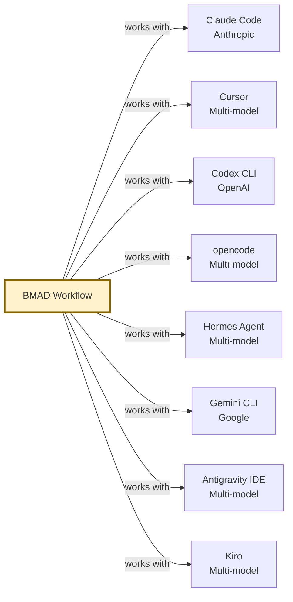

### 1.3 Kenapa Pakai Workflow Ini?

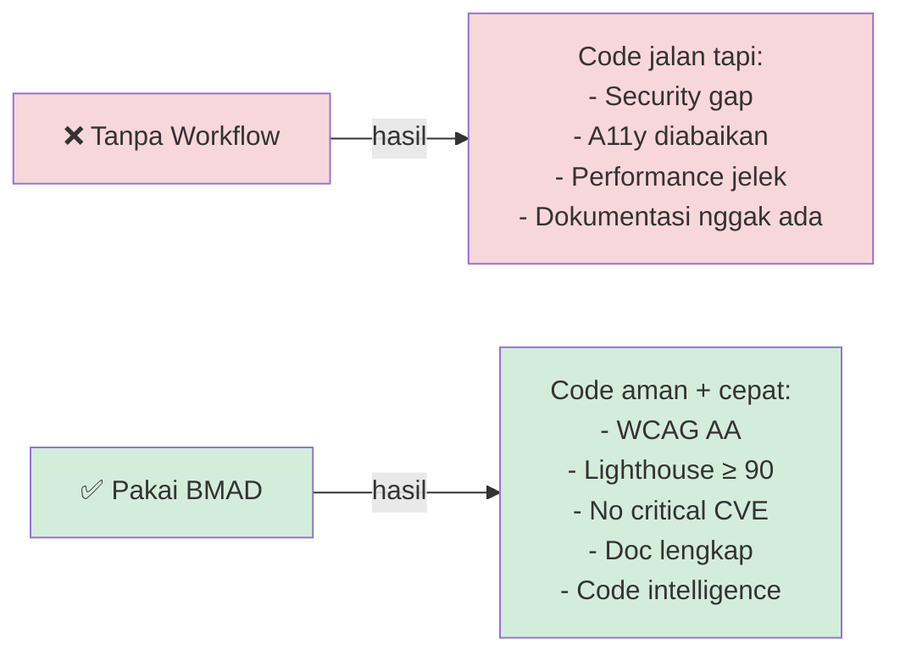

### 1.4 Komponen Utama

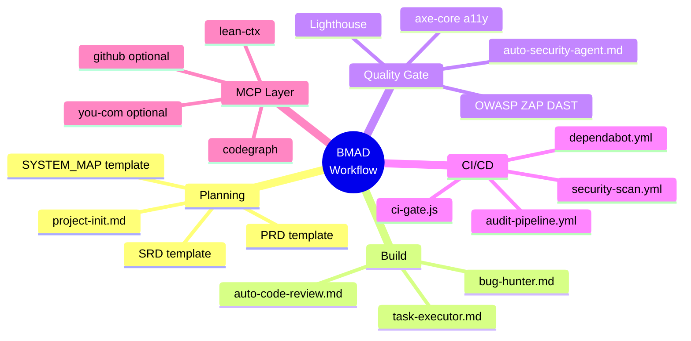

---

## 2. Architecture Project

### 2.1 Struktur Direktori (Visual)

```
BMAD-Workflow-V1.0/
│
├─── 📘 DOCUMENTATION (read-first)
│    ├── README.md                  # Overview cepat
│    └── WORKFLOW_GUIDE.md          # Guide ini
│
├─── 🎯 ENTRY POINT
│    └── bmad-main.md               # ⭐ Wajib upload tiap sesi
│
├─── 📂 templates/                  # Cetakan untuk project lo
│    ├── PRD.template.md
│    ├── SRD.template.md
│    ├── SYSTEM_MAP.template.md     # ⚠️ Paling penting
│    └── mcp.template.json
│
├─── 🤖 AGENT FILES (per phase)
│    ├── project-init.md            # PHASE 0: Onboarding
│    ├── task-executor.md           # PHASE 1: Build planning
│    ├── auto-code-review.md        # PHASE 2: Code review
│    ├── bug-hunter.md              # PHASE 2: Debug
│    └── auto-security-agent.md     # PHASE 3-4: Audit
│
├─── ⚙️ CI/CD (copy ke project)
│    ├── .github/
│    │   ├── dependabot.yml
│    │   └── workflows/
│    │       ├── audit-pipeline.yml
│    │       └── security-scan.yml
│    └── scripts/
│        └── ci-gate.js
│
└─── 📚 REFERENCE
     ├── audit-checklist.md
     └── accessibility-wcag.md
```

### 2.2 Hubungan Antar File

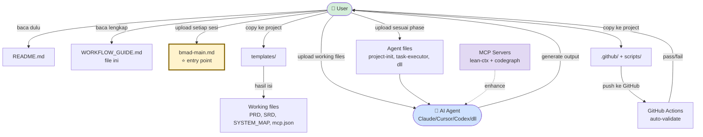

---

## 3. Mental Model: 4 Tipe File

Sebelum mulai, lo HARUS paham 4 tipe file di repo ini.

### 3.1 Diagram Alur File

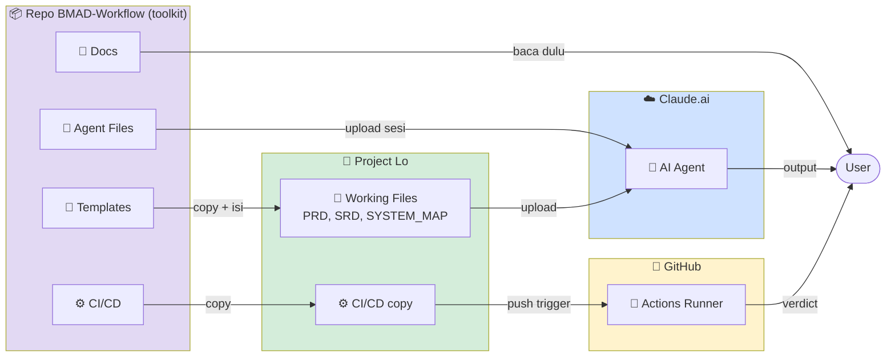

### 3.2 Tabel Perbedaan

| Tipe | Ada di Mana | Diisi Siapa | Di-update Kapan |
|---|---|---|---|
| 📘 Docs | Repo workflow | Maintainer toolkit | Kalau ada update workflow |
| 📂 Templates | `/templates/` | Maintainer toolkit | Update terstruktur |
| 📝 Working Files | Project lo | Lo + AI | Setiap progress project |
| 🤖 Agent Files | Repo workflow | Maintainer toolkit | Stabil, jarang berubah |
| ⚙️ CI/CD | Repo workflow + project lo | Lo customize | Project-specific tweaks |

### 3.3 Aturan Emas

```
┌──────────────────────────────────────────────────┐
│                                                  │
│   Repo BMAD-Workflow  =  TOOLKIT (cetakan)      │
│   Project lo          =  TEMPAT KERJA           │
│                                                  │
│   ❌ Jangan isi PRD.md di repo workflow         │
│   ✅ Copy template dulu, baru isi di project    │
│                                                  │
└──────────────────────────────────────────────────┘
```

---

## 4. Pipeline 7 Phase Detail

### 4.1 Big Picture Pipeline

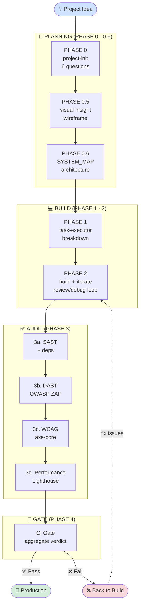

### 4.2 PHASE 0 — Project Init

**Tujuan:** Setup project dari nol — generate PRD + SRD.

**Cara pakai:**

```
Step 1: Upload bmad-main.md + project-init.md ke Claude.ai
Step 2: Ketik: "Jalankan PHASE 0: project-init"
Step 3: Jawab 6 pertanyaan:
        1. Nama project?
        2. Masalah yang diselesaikan?
        3. Target user?
        4. 3-5 fitur utama?
        5. Tech stack (FE/BE/DB)?
        6. Deploy di mana?
Step 4: Claude generate PRD.md + SRD.md
Step 5: Copy-paste output ke working files lo
```

**Hasil:**
- ✅ `PRD.md` terisi (product requirements)
- ✅ `SRD.md` terisi (system requirements)

---

### 4.3 PHASE 0.5 — Visual Insight

**Tujuan:** Alignment visual sebelum nulis kode.

**Cara pakai:**

```
Step 1: Upload bmad-main.md + PRD.md (yang udah jadi)
Step 2: Ketik: "Jalankan PHASE 0.5: visual insight"
Step 3: Claude generate:
        - Diagram arsitektur high-level
        - User flow utama
        - Data model / ERD (kalau relevan)
        - Wireframe kasar (kalau UI-heavy)
```

**Output yang lo dapet:** Mermaid diagrams + ASCII wireframes.

---

### 4.4 PHASE 0.6 — Isi SYSTEM_MAP.md

**Tujuan:** Definisikan arsitektur lengkap supaya AI nggak nebak-nebak.

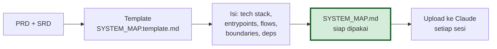

**Section yang harus diisi:**
- Project Snapshot (nama, type, goal, stage)
- Tech Stack (FE/BE/DB/cache/hosting)
- Top-Level Layout (folder structure)
- Entry Points (route, API, worker, CLI)
- Runtime Flows (auth, business, payment, notification)
- Module Boundaries
- Integration Points
- Data Model

> ⚠️ **PENTING:** SYSTEM_MAP.md adalah file paling kritis. AI baca ini untuk paham project lo. Kalau kosong, AI akan nebak dan hasilnya jelek.

---

### 4.5 PHASE 1 — Task Executor

**Tujuan:** Convert PRD + SRD jadi task list konkret.

**Input:** PRD + SRD + SYSTEM_MAP
**Output:**

```
Feature: User Authentication
├── FE Tasks:
│   ├── Login form component
│   ├── Register form component
│   └── Session management hook
├── BE Tasks:
│   ├── Auth middleware
│   ├── JWT generator
│   └── Password hasher (bcrypt)
├── API Endpoints:
│   ├── POST /api/auth/login
│   ├── POST /api/auth/register
│   └── POST /api/auth/refresh
└── DB Schema:
    └── users (id, email, password, role, ...)

Implementation Order:
1. DB schema + migration
2. BE: auth service + JWT
3. BE: API endpoints + middleware
4. FE: forms + state mgmt
5. FE: integration + error handling
```

---

### 4.6 PHASE 2 — Build + Iterate

**Tujuan:** Loop build → review → debug.

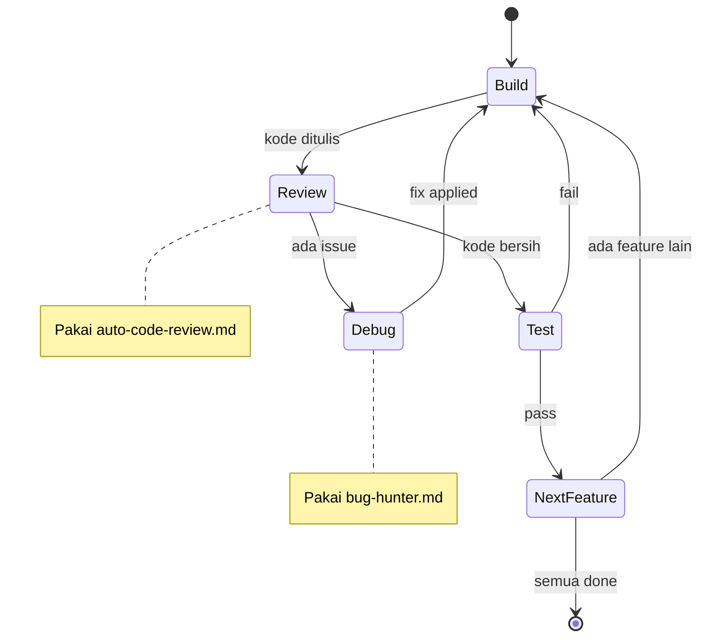

**Sebelum edit file apapun, cek SYSTEM_MAP.md dulu:**

```
Target file       : src/api/auth/login.ts
Entrypoint        : POST /api/auth/login
Upstream callers  : LoginForm.tsx
Downstream deps   : authService, userRepo
Risk              : Medium (auth-critical)
```

---

### 4.7 PHASE 3 — Audit Pipeline

**Tujuan:** Validasi quality sebelum deploy.

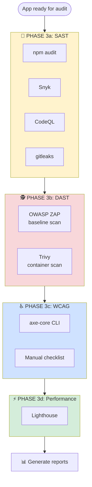

**Hasil:** 4 report files
- `npm-audit.json` + `snyk.sarif`
- `zap-report.json`
- `axe-results.json`
- `lighthouse-report.json`

---

### 4.8 PHASE 4 — CI Gate

**Tujuan:** Aggregate semua audit → satu verdict PASS / FAIL.

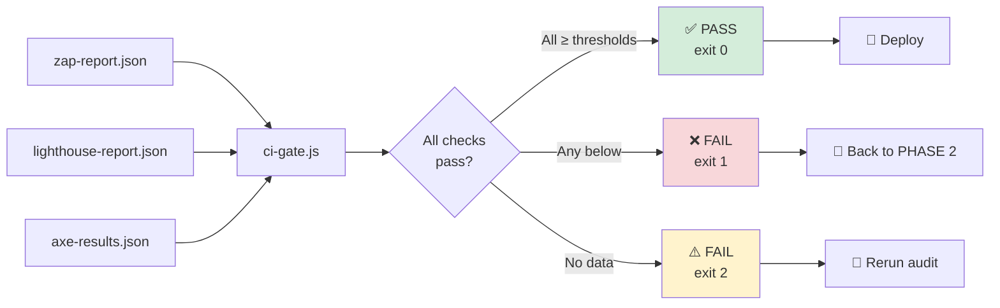

**Thresholds:**

| Check | Threshold | Block? |
|---|---|---|
| Lighthouse Performance | ≥ 90 | ✅ |
| Lighthouse Accessibility | ≥ 90 | ✅ |
| Lighthouse Best Practices | ≥ 90 | ✅ |
| Lighthouse SEO | ≥ 90 | ✅ |
| DAST High alerts | 0 | ✅ |
| WCAG Critical | 0 | ✅ |
| WCAG Serious | 0 | ✅ |

---

## 5. Security Architecture

### 5.1 Defense in Depth

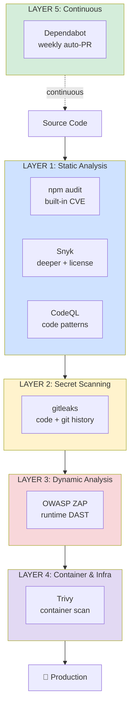

### 5.2 OWASP Top 10 Coverage

| Risk | Detection Layer |
|---|---|
| A01 Broken Access Control | DAST + manual SAST checklist |
| A02 Cryptographic Failures | SAST + manual review |
| A03 Injection | DAST + CodeQL |
| A04 Insecure Design | Manual (PHASE 0–0.6) |
| A05 Security Misconfiguration | DAST + Trivy |
| A06 Vulnerable Components | npm audit + Snyk + Dependabot |
| A07 Auth Failures | DAST + manual SAST |
| A08 Software & Data Integrity | Trivy + SBOM (optional) |
| A09 Logging & Monitoring | Manual checklist |
| A10 SSRF | DAST + CodeQL |

---

## 6. Workflow End-to-End — Real Example

### Scenario: Bikin "Todo App with Auth"

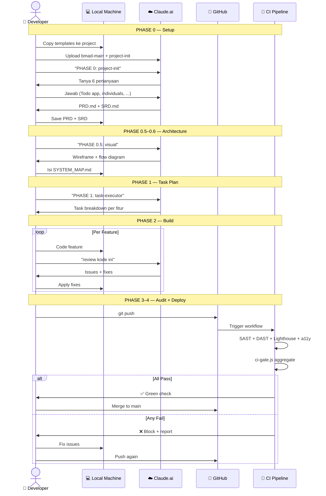

---

## 7. Cheat Sheet

### 7.1 Trigger Commands

| Phase | Command di Claude |
|---|---|
| 0 | `Jalankan PHASE 0: project-init` |
| 0.5 | `Jalankan PHASE 0.5: visual insight` |
| 0.6 | `Bantu isi SYSTEM_MAP.md berdasarkan PRD + SRD ini: [paste]` |
| 1 | `Jalankan PHASE 1: task-executor` |
| 2 review | `Jalankan PHASE 2: review kode ini [paste]` |
| 2 debug | `Jalankan PHASE 2: fix this error [paste error + code]` |
| 3 | `Jalankan PHASE 3: full audit` |
| 4 | `Jalankan PHASE 4: validasi hasil Lighthouse ini` |

### 7.2 File yang Wajib Diupload

```
SETIAP SESI:
  ✓ bmad-main.md
  ✓ SYSTEM_MAP.md (kalau udah ada)

PHASE 0:        + project-init.md
PHASE 1-2:      + PRD.md + SRD.md + task-executor.md
PHASE 2 review: + auto-code-review.md
PHASE 2 debug:  + bug-hunter.md
PHASE 3-4:      + auto-security-agent.md + accessibility-wcag.md + audit-checklist.md
```

### 7.3 Common Pitfalls

| ❌ Salah | ✅ Benar |
|---|---|
| Edit PRD.md di repo workflow | Copy template dulu, edit di project lo |
| Skip SYSTEM_MAP.md | Isi dulu — paling kritis |
| Upload semua file tiap sesi | Upload per phase, hemat token |
| Ignore audit fail | Fix dulu, jangan skip |
| Pakai `npm install` di CI | Pakai `npm ci` (deterministic) |
| Image `owasp/zap2docker-stable` | Pakai `ghcr.io/zaproxy/zaproxy:stable` |

---

## 8. Convert Guide ini ke PDF

### Opsi A: Built-in script ⭐ (recommended)

Script `scripts/build-pdf.js` udah include — render Mermaid native, pakai Chrome/Edge yang udah ada di sistem (no extra install, cuma butuh `node`).

```bash
node scripts/build-pdf.js
# Output: WORKFLOW_GUIDE.pdf (~1.7 MB dengan semua Mermaid diagram)
```

Custom input/output:

```bash
node scripts/build-pdf.js docs/CUSTOM.md out/custom.pdf
```

**Yang di-handle otomatis:**
- ✅ Mermaid diagrams (render via CDN, headless Chrome)
- ✅ GFM tables, code blocks, blockquote
- ✅ Cover page dari YAML frontmatter
- ✅ Auto-install `marked` dependency (one-time, ~50 KB)
- ✅ Cross-platform (Windows/Mac/Linux — auto-detect Chrome/Edge)

### Opsi B: Pandoc (CLI)

```bash
# Install pandoc dulu (sekali aja)
# Windows: https://pandoc.org/installing.html

pandoc WORKFLOW_GUIDE.md \
  -o WORKFLOW_GUIDE.pdf \
  --pdf-engine=xelatex \
  --toc \
  --toc-depth=3 \
  -V geometry:margin=2cm \
  -V mainfont="Calibri"
```

> ⚠️ Pandoc nggak render Mermaid native. Pre-render diagram ke `.png` pakai `mermaid-cli`, atau pakai Opsi A.

### Opsi C: VSCode Extension

1. Install extension `Markdown PDF` (yzane.markdown-pdf)
2. Buka `WORKFLOW_GUIDE.md`
3. Right-click → `Markdown PDF: Export (pdf)`

### Opsi D: Typora

1. Buka `WORKFLOW_GUIDE.md` di Typora
2. File → Export → PDF

---

## 9. Resources & Next Steps

### Dokumentasi Tambahan

- 📘 [`README.md`](./README.md) — Overview cepat
- 🎯 [`bmad-main.md`](./bmad-main.md) — Entry point + philosophy
- 🤖 [`auto-security-agent.md`](./auto-security-agent.md) — Security pipeline detail
- ♿ [`accessibility-wcag.md`](./accessibility-wcag.md) — WCAG guidelines
- 📋 [`audit-checklist.md`](./audit-checklist.md) — Manual checklist

### External Tools

- [OWASP ZAP](https://www.zaproxy.org/) — DAST scanner
- [Lighthouse](https://developer.chrome.com/docs/lighthouse/) — Performance audit
- [axe-core](https://github.com/dequelabs/axe-core) — Accessibility testing
- [Snyk](https://snyk.io/) — Dependency security
- [Dependabot](https://docs.github.com/en/code-security/dependabot) — Auto updates
- [CodeQL](https://codeql.github.com/) — SAST
- [gitleaks](https://github.com/gitleaks/gitleaks) — Secret scanner
- [Trivy](https://trivy.dev/) — Container scanner

### Standards & References

- [WCAG 2.1 Quick Reference](https://www.w3.org/WAI/WCAG21/quickref/)
- [OWASP Top 10](https://owasp.org/www-project-top-ten/)
- [Web Content Accessibility Guidelines](https://www.w3.org/TR/WCAG21/)
- [Mozilla Web Security Guidelines](https://infosec.mozilla.org/guidelines/web_security)

---

## 10. Closing

```
┌──────────────────────────────────────────────────┐
│                                                  │
│   Quality bukan optional — quality itu GATED.   │
│                                                  │
│   ✅ Lolos pipeline = layak deploy              │
│   ❌ Gagal = balik ke PHASE 2                   │
│                                                  │
│   Trust the process. The pipeline catches       │
│   what humans miss.                              │
│                                                  │
└──────────────────────────────────────────────────┘
```

**Pertanyaan?** Buka issue di repo, atau diskusi di community channel.

**Lisensi:** MIT — silakan customize sesuai kebutuhan project lo.

---

*Dokumen ini di-generate sebagai bagian dari BMAD Workflow V1.0. Last updated: 2026-05-31.*
